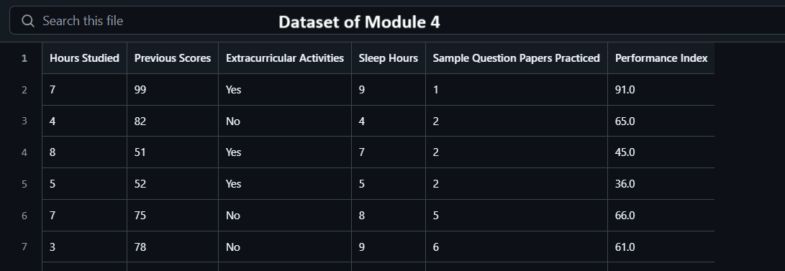

## 1. What are the two primary components of a dataset used in supervised machine learning?

- **Features (Inputs)**:
   These are the variables or attributes used by the model to make predictions. Each feature represents a measurable property of the data.

   * Example: In a housing price prediction dataset, features might include number of bedrooms, square footage, location, etc.

- **Targets (Labels / Outputs)**:
   These are the values the model is trying to predict or classify. The label is what the model learns to associate with the features during training.

   * Example: In the same housing dataset, the label would be the house price.

🧠 For unsupervised learning, labels might not be present—only features are used to find patterns or clusters.

---

## 2. What are features in a machine learning dataset, and what role do they play in model training?

Features are the input variables or measurable properties of the data used by a machine learning model to make predictions.

---

## 3. Based on the given dataset, which columns represent the features and which one represents the target variable for machine learning, and how many features and targets?

### ✅ **Features (Inputs): (5 Features)**

These are the columns used to predict performance:

1. **Hours Studied**
2. **Previous Scores**
3. **Extracurricular Activities**
4. **Sleep Hours**
5. **Sample Question Papers Practiced**

### 🎯 **Target (Label / Output): (1 Target)**

This is the column the model tries to predict:

---

## 4. In an image dataset used for machine learning, what are considered the features ?

In an image dataset, the features are the pixel values of the images.

---

## 5. In a grayscale image dataset where each image is 64×64 pixels, how many features does each image have, and why?

Each image has 4,096 features because a 64×64 image has 64 × 64 = 4,096 pixels, and in grayscale, each pixel is represented by a single intensity value (feature).

---

## 6. In an RGB image dataset where each image is 64×64 pixels, how many features does each image have, and why?

Each image has 12,288 features because a 64×64 RGB image has 64 × 64 = 4,096 pixels, and each pixel has 3 color channels (Red, Green, Blue).
So, 4,096 pixels × 3 channels = 12,288 features per image.

---

## 7. How many features in the dataset of Module 5.1?

100 x 100 x 3 = 30 000

---

## 8. What is the target of the dataset?

Shape (Circle or Squre)

## 9. Why is it better to convert images to grayscale before feature extraction in the case of Module 5.1?

Since the images are binary, loading them as RGB unnecessarily increases the number of features without adding useful information.

